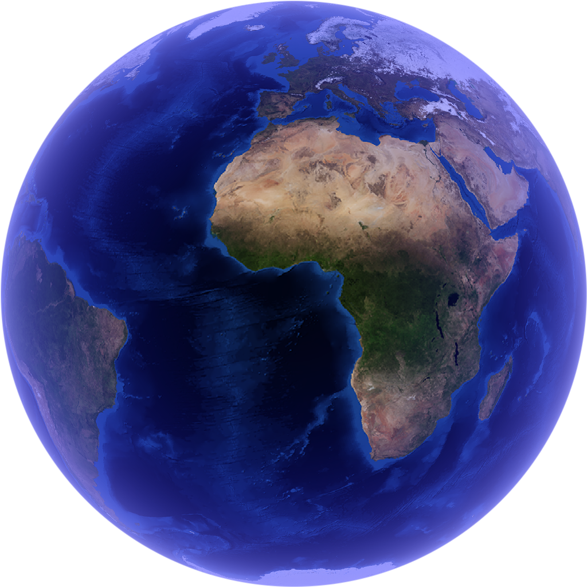
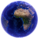
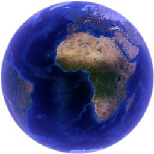
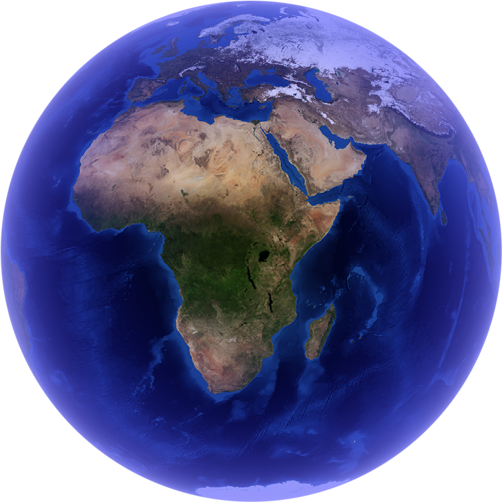
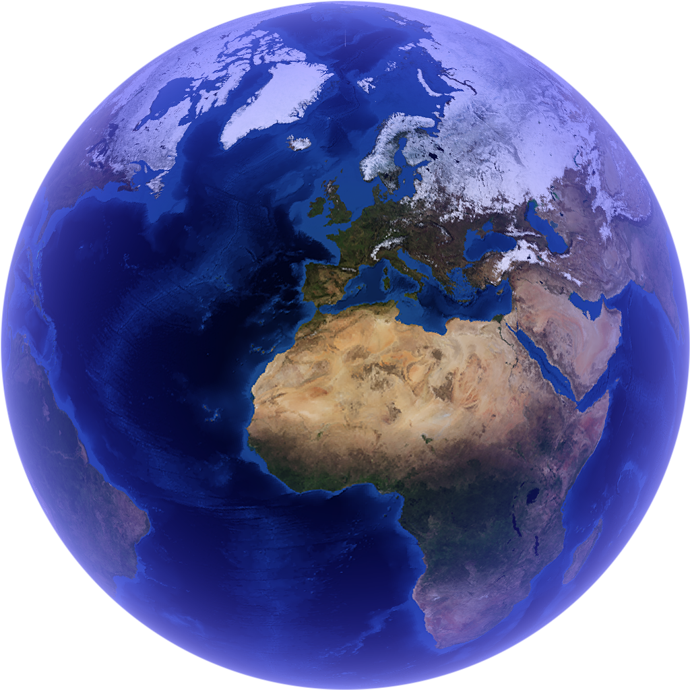
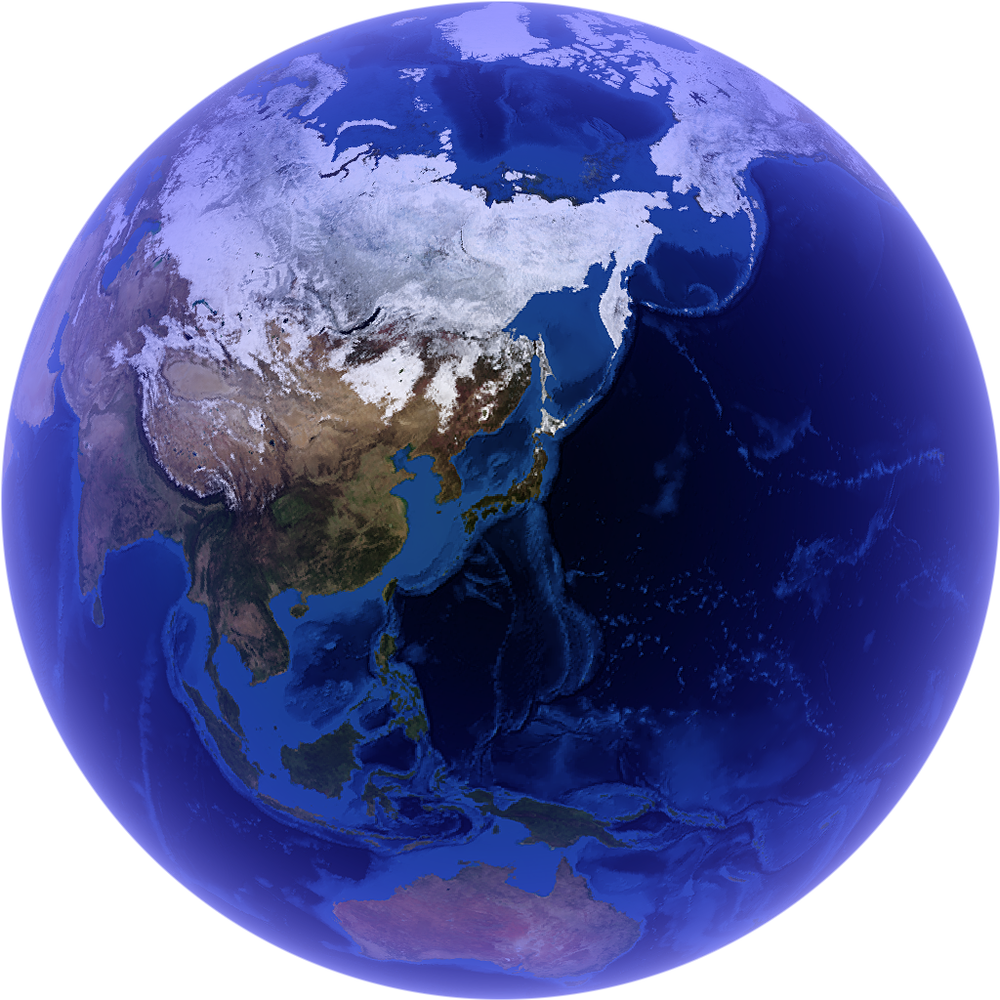
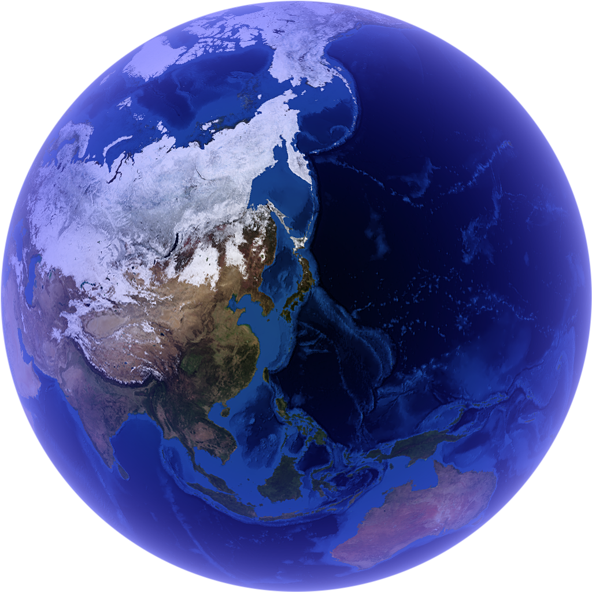

<h1 align="center">
    <picture>
        <source media="(prefers-color-scheme: light)" srcset="/.github/artefacts/logo-black.svg">
        <source media="(prefers-color-scheme: dark)" srcset="/.github/artefacts/logo-white.svg">
        
    </picture>
</h1>

[](https://github.com/gotloaf/earthly/releases/latest)
[](https://goreportcard.com/report/github.com/gotloaf/earthly)
[](https://github.com/gotloaf/earthly/actions)

Earthly is an API for generating images of Earth. The core rendering functionality is accessible via HTTP GET, making it available either via the request library of your choice, or by generating URLs to be directly included into Markdown or other similar documents.

A hosted version is available at [`https://earthly.gotloaf.dev`](https://earthly.gotloaf.dev/?size=512&longitude=135&latitude=30&roll=-15). Swagger format API documentation is [also available](https://earthly.gotloaf.dev/swagger/index.html), compliant with OpenAPI 2.0.


## Usage & Parameters

You can expand the following section for examples on how to use earthly.

<details>
<summary>Parameter documentation</summary>

### Strict mode

When requesting from earthly, you can choose to either request in strict or lax mode. Strict mode ensures that necessary parameters are specified and are of the correct format, whereas lax mode will try to make the best of the parameters provided.

If you are using earthly as an API (e.g. via a request library), you most likely want strict mode **on**. This will give you feedback about any parameter format errors.

If you are embedding earthly URLs directly into documents (e.g. via Markdown), you most likely want strict mode **off**. This ensures that an image will always be displayed, even if the parameters have slight errors in them.

Strict mode is controlled by the `strict` GET parameter. You can see an example below:

| | |
|---|---|
| [/?**strict=false**&size=8192](https://earthly.gotloaf.dev/?strict=false&size=8192)  | </img> |
| [/?**strict=true**&size=8192](https://earthly.gotloaf.dev/?strict=true&size=8192)  | `` {"error":"param `size` is not within bounds [16-2048]\nparam `latitude` could not be parsed\nparam `longitude` could not be parsed"} `` |

### Size

Size is the dimensions in pixels to generate the image at.

| | |
|---|---|
| [/?**size=64**](https://earthly.gotloaf.dev/?size=64)  | </img> |
| [/?**size=256**](https://earthly.gotloaf.dev/?size=256)  | </img> |

### Longitude

Longitude is the east-west rotation of the Earth to display. Positive values go right (towards the east).

| | |
|---|---|
| [/?**longitude=0**](https://earthly.gotloaf.dev/?longitude=0)  | </img> |
| [/?**longitude=30**](https://earthly.gotloaf.dev/?longitude=30)  | </img> |

### Latitude

Latitude is the north-south rotation of the Earth to display. Positive values go up (towards the north).

| | |
|---|---|
| [/?**latitude=0**](https://earthly.gotloaf.dev/?latitude=0)  | </img> |
| [/?**latitude=30**](https://earthly.gotloaf.dev/?latitude=30)  | </img> |

### Roll

Roll rotates the camera around the point it's looking at, tilting the view clockwise.

| | |
|---|---|
| [/?**roll=0**&longitude=135&latitude=35](https://earthly.gotloaf.dev/?roll=0&longitude=135&latitude=35)  | </img> |
| [/?**roll=30**&longitude=135&latitude=35](https://earthly.gotloaf.dev/?roll=30&longitude=135&latitude=35)  | </img> |

### Roll

Zoom is a factor of how zoomed in the image of Earth is, with 1.0 being the normal scale.

| | |
|---|---|
| [/?**zoom=1.0**&longitude=135&latitude=35](https://earthly.gotloaf.dev/?zoom=1.0&longitude=135&latitude=35)  | </img> |
| [/?**zoom=1.25**&longitude=135&latitude=35](https://earthly.gotloaf.dev/?zoom=1.25&longitude=135&latitude=35)  | </img> |

</details>

More details about the parameters can be found in the [hosted documentation](https://earthly.gotloaf.dev/swagger/index.html).

## Alternative setups

This repository contains a variety of ways to use and host earthly.

### Hosted server

To run earthly as a REST HTTP server, first you must build the docs, and then the server. You can see an example of how to do these steps in the [scripts](scripts/unix) folder.

### WASM/Cloudflare Worker

Earthly can be built for WASM, allowing it to be used on serverless platforms like Cloudflare Workers. An example of how to build for WASM is in the [scripts](scripts/unix) folder.

> [!WARNING]
> Cloudflare Workers, alongside many edge runtimes, has both a bundle size and execution time limit. To accommodate for this, the repository contains a [tinygo-based build script](scripts/windows/build_wasm_tinygo.ps1) that uses wasm-opt and wasm-strip to minimize bundle size, and an [example worker file](build/worker.mjs) to demonstrate reasonable limits.

### Command-line interface (CLI)

Earthly can be run to create one-off images using the command line. To use it, run:
```bash
go run ./cmd/cli -longitude -80 -latitude 10
```
By default, it will output PNG data to stdout, but you can also use `-output` to make it output directly to a file. You can also run `go run ./cmd/cli -help` to get information on what flags are available.

## Acknowledgements

Images of the Earth's topography are courtesy of [NASA's Visible Earth project](https://visibleearth.nasa.gov/).
